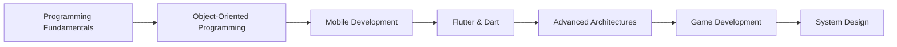

# 👋 Hello, I'm Mai Dương Long

<h3 align="center">A passionate mobile developer from Vietnam with strong enthusiasm for Arch Linux, game development, and app development</h3>

## 🚀 About Me
```dart
class MaiDuongLong extends Developer {
  final String location = 'Vietnam';
  final List<String> passions = [
    'Mobile Development',
    'Arch Linux', 
    'Game Development',
    'App Development'
  ];
  
  final Map<String, dynamic> currentFocus = {
    'learning': 'Flutter',
    'technologies': ['Flutter', 'Dart', 'Android', 'Unity'],
    'interests': ['Clean Architecture', 'State Management', 'Game Engine']
  };
  
  void code() {
    while (true) {
      writeCleanCode();
      learnNewTech();
      contributeToCommunity();
    }
  }
}
```

## 📊 GitHub Stats


## 📈 GitHub Streak


## 🛠️ Technologies & Tools

### Mobile Development


### Game Development


### Operating Systems & Databases


### Development Tools


## 🌱 Currently Learning
- **Flutter & Dart** - Mastering cross-platform development
- **Advanced Mobile Architectures** - Clean Architecture, BLoC Pattern
- **Game Development** - Unity3D, C#
- **System Design** - Scalable mobile applications

## 🎯 Projects & Interests

### 📱 Mobile Apps
- Flutter cross-platform applications
- Native Android development
- UI/UX focused mobile solutions

### 🎮 Game Development
- Unity3D projects
- 2D/3D game development
- Game mechanics and physics

### 🐧 Arch Linux Enthusiast
- Custom Linux environments
- System optimization
- Developer workflow automation

## 📫 Connect With Me
[](https://fb.com/mai.duong.long)
[](https://instagram.com/mailong2401)
[](https://www.leetcode.com/gtmailong)
[](mailto:your.email@gmail.com)

## 💻 Development Environment
```bash
# My typical development setup
OS: Arch Linux
IDE: Neovim / Android Studio
Terminal: zsh with oh-my-zsh
Version Control: Git
```

## 🏆 Achievements
- Passionate about learning new technologies
- Strong problem-solving skills
- Enjoy contributing to open-source projects
- Always exploring new aspects of software development

## ⚡ Fun Facts
- 🐧 **Arch Linux User** - Love customizing my development environment
- 🎮 **Game Development Enthusiast** - Enjoy creating interactive experiences
- 📱 **Mobile First** - Believe in the power of mobile technology
- 🌱 **Continuous Learner** - Always exploring new technologies and frameworks

## 📚 Learning Path


## 🤝 Collaboration Interests
I'm interested in collaborating on:
- Open source Flutter projects
- Mobile app development
- Game development initiatives
- Linux-related development tools

## 🎨 Coding Philosophy
```dart
void main() {
  final passion = Passion.mobileDevelopment();
  final curiosity = Curiosity.neverEnding();
  final code = Code.cleanAndEfficient();
  
  while (alive) {
    develop(passion, curiosity, code);
    learn();
    shareKnowledge();
  }
}
```

---

⭐️ *"The only way to do great work is to love what you do." - Steve Jobs*

---

*README crafted with ❤️ using Flutter-inspired design*

## 🔄 Recent Activity
<!--START_SECTION:activity-->
<!--END_SECTION:activity-->

## 📊 Weekly Development Breakdown
<!--START_SECTION:waka-->
```text
Flutter/Dart   █████████████████████████   80%
Unity/C#       ██████████                  20%
```
<!--END_SECTION:waka-->
